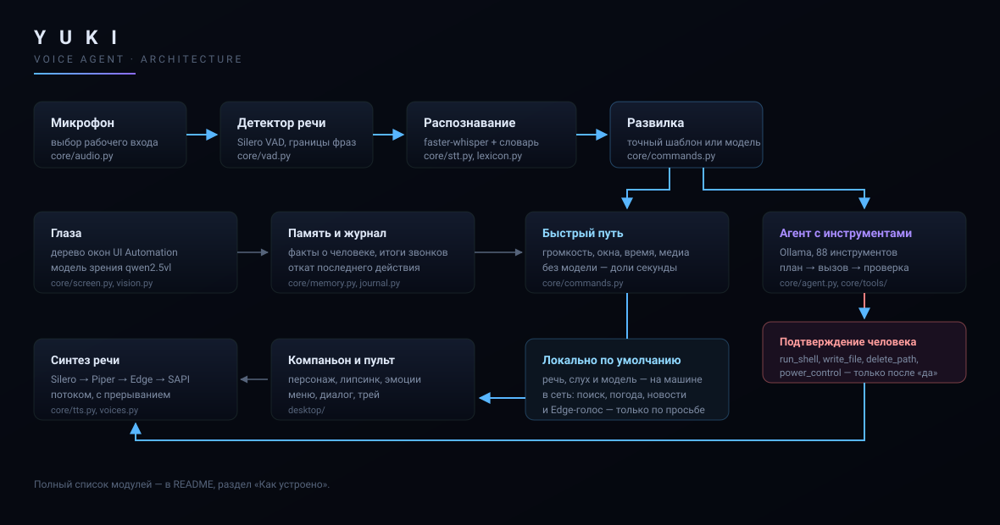

# Юки (Джарвис)

[](https://github.com/dzanuncandrej-gif/yuki-assistant/actions/workflows/ci.yml)
[](LICENSE)
[](https://www.python.org/downloads/)
[](#установка)
[-black.svg)](https://ollama.com)
[](#что-он-умеет)

Локальный голосовой ИИ-агент для Windows с 88 инструментами управления системой,
экранным компаньоном и полноэкранным режимом видеосвязи. Не чат-бот: он слышит
команду, планирует шаги, вызывает инструменты, проверяет результат и отвечает
голосом.

Всё, что можно, работает локально: модель речи, модель распознавания и языковая
модель крутятся на вашем компьютере, без подписки и без API-ключей. В сеть уходят
только те запросы, которые вы сами просите — поиск, новости, погода, нейроголос Edge.



### Содержание

- [Что он умеет](#что-он-умеет) — видеосвязь, учебный режим, компаньон, слух, голос, язык, инструменты
- [Установка](#установка) и [Запуск](#запуск)
- [Примеры команд](#примеры-команд)
- [Настройка](#настройка)
- [Если что-то не работает](#если-что-то-не-работает)
- [Безопасность и ограничения](#безопасность-и-ограничения) — и отдельно [SECURITY.md](SECURITY.md)
- [Как устроено](#как-устроено) и [CONTRIBUTING.md](CONTRIBUTING.md)
- [История изменений](CHANGELOG.md)

---

## Что он умеет

**Видеосвязь с 3D-аватаром**
- Кнопка `◉` в шапке или `Ctrl+D` — открывается полноэкранный режим разговора.
- Аватар нарисован в реальном времени: голова построена знаковыми функциями расстояния
  прямо во фрагментном шейдере — череп, скулы, надбровья, нос, губы, уши, шея. Он дышит,
  моргает, поворачивается, следит взглядом за курсором с микродвижениями зрачков,
  открывает рот по громкости собственной речи.
- Эффекты: радужка с волокнами и бликом, бегущая волна развёртки, полигональная сетка
  при размышлении, хроматическое расхождение и сбой строки при смене состояния,
  двухслойное свечение, сетка пола, частицы, кольца телеметрии за головой.
- Обращение по имени не нужно — микрофон слушает постоянно.
- **Смотрит на экран вживую:** кадры не присылаются, а забираются интерфейсом — очередь
  старых кадров физически не накапливается, картинка не «уезжает», память не растёт.
  Разностный хэш ловит смену сцены и тут же будит модель зрения. Прямой вопрос
  «что ты видишь» отвечает примерно за полторы секунды.
- Захват экрана самовосстанавливается: смена разрешения, блокировка или RDP ломают
  захватчик молча — здесь он пересоздаётся, а в HUD видно `● LIVE · к/с · захват · разбор`.
- **Сам предупреждает о проблемах:** увидев на экране ошибку, отказ или предупреждение,
  Юки первой предлагает помощь (не чаще раза в полторы минуты, и только когда
  не перебивает разговор).
- **Итог звонка:** после отбоя он подводит короткий итог — о чём говорили и что было на
  экране — и кладёт его в долгую память.
- **Камера и лица.** Вместе со звонком включается веб-камера: Юки видит, есть ли
  человек перед экраном, узнаёт знакомые лица и держит на них взгляд аватара — глаза
  следят за тобой, а не за курсором. «Запомни моё лицо, я Андрей» — и дальше он
  здоровается по имени. Всё локально: детектор YuNet (230 КБ) и SFace (37 МБ),
  векторы лиц лежат в `data/faces.json`.
- **Жесты рукой.** Камера понимает пять жестов и выполняет их мгновенно, без модели:

  | Жест | Действие |
  |---|---|
  | ☝ указательный палец | воспроизведение или пауза |
  | 👌 «окей» | режим громкости: расстояние между пальцами и есть громкость |
  | ✌ два пальца | следующий трек |
  | ✋ раскрытая ладонь | тишина: обрывает речь и ставит паузу |
  | ✊ кулак | выключить или включить микрофон |
| 🤟 три пальца | показать или спрятать панель компаньона |

  Жест должен продержаться примерно полсекунды и потом «остывает» — случайный взмах
  рукой музыку не запустит.
- **Быстрый ответ в звонке.** Простая реплика уходит в лёгкую модель (`fast_model`) и
  возвращается за доли секунды; тяжёлая модель с инструментами подключается, только
  когда нужно что-то сделать.
- **Журнал действий с откатом.** Всё, что Юки меняла в системе, попадает в ленту:
  «что ты сделал» покажет список, «отмени последнее» вернёт как было. Обратимы
  громкость, яркость, создание папки, перезапись файла (хранится прежнее содержимое),
  перемещение и переименование.
- Справа — HUD: живой кадр экрана с частотой, описание сцены, телеметрия машины,
  лента диалога.
- **Маленькое окно:** кнопка «В УГОЛ», `Ctrl+M` или двойной щелчок — окно
  сворачивается в окошко 340×430 поверх всех окон, его можно таскать мышью за любое
  место. `Esc` возвращает полный режим, второй `Esc` завершает звонок.

**Учебный режим**
- Решает школьные задания до 11 класса: математика, физика, химия, биология, русский,
  история, география, информатика, английский, обществознание.
- Ответ по школьной схеме: дано → что найти → решение по шагам с формулами →
  проверка → ответ отдельной строкой. Вслух произносится только ответ и суть,
  полный разбор остаётся на экране.
- Предмет и класс определяются сами по условию.
- **Арифметика перепроверяется кодом:** равенства из решения пересчитываются, и если
  модель ошиблась в счёте, к ответу добавляется поправка. Языковые модели ошибаются
  в устном счёте чаще, чем в рассуждении.
- Задание можно не набирать: `solve_from_screen` читает его прямо с экрана,
  `solve_from_camera` — с тетради или учебника через камеру.

**Экранный компаньон**
- На рабочем столе живёт персонаж. Если положить свой рисунок в
  `assets/companion/reference.png` и разобрать его на слои скриптом
  `scripts/build_companion_assets.py`, слои двигаются как двумерная марионетка:
  голова поворачивается вокруг шеи, веки закрываются сжатием полосы глаз, рот
  раскрывается вставкой полости между губами, боковые пряди уводит наружу и
  возвращает пружиной, корпус дышит и покачивается. Без своего рисунка (в
  репозитории его нет — художественные материалы у каждого свои, права на
  готовое аниме-арт передавать нельзя) компаньон рисуется встроенным векторным
  риггом (`desktop/companion/rig.py`) — приложение работает и так.
- Для полноэкранной 3D-видеосвязи (`ui3d/`) характер персонажа тоже
  подставляется отдельно: положи свою модель в `ui3d/characters/<имя>/`
  (формат — `ui3d/characters/index.json` и `avatar.json` рядом с готовыми
  примерами структуры) и впиши её `id` в `config.json → companion.character`.
- Взгляд следит за курсором, между делом живёт микродвижениями; моргание
  случайное, иногда двойное; рот открывается по громкости собственной речи.
- Эмоции: спокойствие, радость, смех, удивление, смущение, грусть, дремота,
  подмигивание, приветствие, тревога. Состояние ассистента выбирает эмоцию само,
  разовая реакция ставится поверх.
- Панель без рамки, поверх окон, перетаскивается за фигуру. Под персонажем — свет,
  кольца телеметрии и пылинки в цвет состояния; сверху — капсула с именем и
  эквалайзером; реплики выводятся облаком с набором текста по буквам.
- Панель управления под фигурой проявляется при наведении и прячется сама:
  микрофон, видеосвязь, меню, скрыть. Правый щелчок — эмоции и положение окна.
- Голоса компаньона женские и живые: **МИРА**, **ЮКИ**, **СОРА** (Silero `xenia`,
  `kseniya`, `baya` плюс аниме-обработка тембра).
- Показать или спрятать: `Ctrl+J`, кнопка ❋ в шапке окна, пункт в трее, жест 🤟.

**Меню управления (`Ctrl+,`)**
- Прямоугольное окно в тёмном космическом стиле: звёздная пыль на фоне, стеклянные
  карточки, боковая навигация, плавные переходы разделов.
- Разделы: **Голос** (профиль, движок, громкость, слух), **Язык** (интерфейс и
  распознавание), **Интеллект** (модели, поведение, зрение и жесты), **Персонаж**
  (компаньон, внешний вид, живость, живое превью с эмоциями), **Аккаунт**
  (оператор, город, область поиска, состояние системы).
- Любое изменение применяется сразу и сохраняется в `config.json`; кнопки
  «применить» нет.

**Слух**
- Микрофон выбирается сам: Windows часто оставляет устройством по умолчанию заглушённый
  вход, который отдаёт ровную цифровую тишину — Юки проверяет устройства и берёт то,
  где есть сигнал, о чём пишет в журнале.
- Границы фразы ищет нейросетевой детектор Silero, а не порог громкости: 360 мс звука
  до начала речи добираются из буфера, поэтому первый слог не срезается.
- Перед распознаванием звук выравнивается по громкости — тихий микрофон больше не
  причина «он меня не понимает».
- Расслышанные слова правятся по словарю команд: «Джорвис» → «Джарвис», «громкасть» →
  «громкость», «скрыншот» → «скриншот». Свободный текст после «напиши» и «найди»
  не трогается. На тестовом наборе доля ошибок падает вчетверо.
- В режиме звонка фоновая речь из колонок игнорируется: реплика принимается, если
  назвали по имени, если разговор уже идёт или если фраза начинается как команда/вопрос.

**Голос**
- Распознавание речи (faster-whisper) на русском или английском — переключение в
  разделе «Язык» ниже, обращение по имени.
- У каждого голоса своё имя: «Джарвис», «Атлас», «Аура». Позвали чужим именем —
  ассистент переключится на этот голос. Имя узнаётся даже при ошибках распознавания
  («джарис», «атлаз», «Джар вис»).
- Три голоса, все локальные. Основной движок — **Silero v4** (одна модель 38 МБ на всех
  дикторов): шесть секунд речи синтезируются примерно за 0.05 секунды.

  | Голос | Характер | Диктор Silero | Запасной Piper |
  |---|---|---|---|
  | **ДЖАРВИС** | низкий спокойный мужской | `aidar` | `ru_RU-dmitri-medium` |
  | **АТЛАС** | молодой естественный мужской | `eugene` | `ru_RU-ruslan-medium` |
  | **АУРА** | мягкий женский | `baya` | `ru_RU-irina-medium` |
  | **МИРА** | живой аниме-женский, тёплый | `xenia` | `ru_RU-irina-medium` |
  | **ЮКИ** | звонкий аниме-женский, игривый | `kseniya` | `ru_RU-irina-medium` |
  | **СОРА** | спокойный аниме-женский, мягкий | `baya` | `ru_RU-irina-medium` |

- Тракт обработки студийный: срез гула, вырез «картона» середины, подъём разборчивости
  и воздуха, мягкая компрессия и нормализация громкости.
- Короткие частые фразы («Готово.», «Слушаю.») кэшируются и звучат мгновенно.
- Если движок падает (например библиотеку Piper заблокировала защита Windows),
  Юки говорит об этом в журнале и сама переходит на следующий: Silero → Piper →
  Edge → системный SAPI.

- Переключение: голосом («переключись на Атлас», «включи Ауру», «смени голос на Джарвиса»),
  списком в нижней панели окна, из меню в трее или командой агента `set_voice`.
  Кнопка **▶** рядом со списком даёт послушать голос, не меняя текущий.
- Выбор сохраняется в `config.json` и переживает перезапуск; все установленные голоса
  подгружаются в память фоном, поэтому переключение мгновенное.
- Синтез потоковый: первое слово звучит через 0.2–0.3 секунды после ответа модели.
- Прерывание: скажите «стоп», «хватит», «замолчи» — или просто заговорите громко.
- После ответа 20 секунд можно продолжать без обращения по имени.

**Язык**
- По умолчанию всё по-русски. Команда «говори по-английски» (или «switch to
  english») на ходу переключает распознавание речи, свободный ответ модели и
  голос синтеза (Edge — единственный движок с английскими голосами из коробки;
  Silero и Piper знают только русский). Вернуть — «говори по-русски» / «switch
  to russian». То же самое переключает выпадающий список «Речь» в разделе
  «Язык» меню управления. Выбор сохраняется в `config.json`.
- Интерфейс (меню, кнопки, подписи) переводится отдельно: `config.json →
  ui.language` или список «Язык» в том же разделе меню. Применяется при
  следующем запуске Юки — окно строится один раз при старте, поэтому смена
  языка на лету, без перезапуска, интерфейс не подхватит.
- Готовые фразы точных команд («Открыла.», «Готово.» и подобные — `core/commands.py`)
  и динамические статусы разделов «Сообщения»/«Сценарии» остаются русскими в
  любом режиме: перевести их все — отдельная большая задача, сюда не входит.
  Разговор и ответы агента — полностью на выбранном языке, статичные надписи
  интерфейса — по `core/i18n.py`.

**Действия (88 инструментов)**
| Область | Инструменты |
|---|---|
| Время | `get_time`, `timer`, `list_timers`, `wait` |
| Сеть | `web_search`, `read_webpage`, `get_news`, `get_weather`, `get_forecast` |
| Медиа | `play_music`, `play_video`, `media_control` |
| Браузер | `open_website`, `browser_search`, `browser_goto`, `browser_page_text`, `browser_control` |
| Приложения | `open_app`, `close_app`, `list_windows`, `focus_window`, `window_control`, `running_apps` |
| Файлы | `create_folder`, `write_file`, `read_file`, `list_folder`, `find_files`, `open_path`, `move_path`, `copy_path`, `delete_path`, `disk_space` |
| Ввод | `type_text`, `type_into`, `press_keys`, `mouse_click`, `mouse_move`, `scroll`, `screen_size` |
| Экран и элементы окна | `take_screenshot`, `look_at_screen`, `look_at_image`, `read_screen`, `read_window_text`, `list_windows_on_screen`, `list_controls`, `click_control`, `wait_for_control` |
| Голос | `list_voices`, `set_voice`, `test_voice` |
| Память | `remember`, `recall`, `forget` |
| Камера | `camera_look`, `remember_face`, `forget_face`, `camera_describe` |
| Журнал | `recent_actions`, `undo_last` |
| Сообщения | `send_message`, `open_chat`, `find_contact`, `confirm_contact`, `cancel_message`, `send_to_contact` (Telegram, WhatsApp, Discord, Slack) |
| Учебный режим | `solve_task`, `explain_topic`, `solve_from_screen`, `solve_from_camera` |
| Сценарии | `list_workflows`, `run_workflow` |
| Система | `volume_set/change/get`, `mute_toggle`, `brightness_set/get`, `clipboard_get/set`, `system_stats`, `kill_process`, `lock_computer`, `power_control`, `network_adapter`, `empty_recycle_bin`, `run_shell` |

**Честность вместо отчётов**
- Каждый инструмент проверяет результат: приложение — по появившемуся окну, файл — по
  наличию на диске, сообщение — по опустевшему полю ввода.
- Если модель отвечает «сделал», не вызвав инструмент, агент возвращает её обратно и
  требует выполнить действие. Не получилось — Юки скажет, что не получилось.

---

## Установка

Нужны Windows 10/11, Python 3.12 и [Ollama](https://ollama.com).

```powershell
git clone https://github.com/dzanuncandrej-gif/yuki-assistant.git
cd yuki-assistant
powershell -ExecutionPolicy Bypass -File install.ps1
```

Скрипт создаёт `.venv`, ставит зависимости, качает голос Piper и модель распознавания,
подтягивает модель агента (`qwen3:8b`, ~5 ГБ) и модель зрения, кладёт ярлык на рабочий стол.

## Запуск

```powershell
.\start.ps1                              # окно приложения
.\start.ps1 -Silent                      # в трее, без консоли
.\start.ps1 -Admin                       # с правами администратора (см. «Ввод заблокирован»)
.\start.ps1 -Devices                     # список микрофонов
.\start.ps1 -Web                         # старый режим: сервер + браузер
.\start.ps1 -InstallShortcut             # ярлыки на рабочем столе и в меню «Пуск»
.\start.ps1 -InstallShortcut -Autostart  # плюс запуск при входе в систему
.\start.ps1 -UninstallShortcut           # удалить все ярлыки Юки
```

Ярлык ведёт на `pythonw.exe main.py` из `.venv` проекта, с рабочей папкой проекта
и иконкой `assets/yuki.ico` — консольное окно не появляется.

Горячие клавиши: `Ctrl+Alt+J` — показать/скрыть, `Ctrl+D` — видеосвязь,
`Ctrl+,` — меню управления, `Ctrl+J` — панель компаньона,
`Ctrl+Space` — замолчать, `Ctrl+L` — поле ввода, `Ctrl+R` — очистить контекст,
`Ctrl+M` — компактный режим.

Модель голоса ставится отдельно (если её ещё нет):

```bash
python scripts/download_voice_model.py
```

---

## Примеры команд

```
Юки, открой телеграм, найди Алису и отправь: буду через час
Юки, запомни: я работаю над проектом
Юки, что ты помнишь про мои привычки
Атлас, какая погода            (позвали другим именем — сменится голос)
Юки, переключись на Атлас
Юки, какие есть голоса
Юки, как звучит Аура
Юки, который час
Юки, какие сегодня новости — расскажи про две главные
Юки, найди в интернете, сколько стоит биткоин
Юки, открой телеграм и напиши папе: буду через час
Юки, открой ютуб и включи Metallica
Юки, создай на рабочем столе папку отчёты
Юки, сделай скриншот и скажи, что на экране
Юки, громкость 30
Юки, что у меня запущено
Юки, напомни через 20 минут выключить плиту
Say "switch to english" — говорит и слушает по-английски
```

Многошаговые задачи выполняются целиком: открыть приложение → дождаться окна →
напечатать → отправить → проверить.

---

## Настройка

`config.json` — основные параметры (в git не попадает, как и `.env` — ключи и личные
значения). Без него ассистент работает на встроенных умолчаниях; чтобы что-то
поправить, скопируйте `config.example.json` в `config.json` и правьте копию.

```jsonc
{
  "brain": {
    "model": "qwen3:8b",      // модель агента в Ollama
    "max_steps": 8,            // сколько шагов инструментов на одну задачу
    "think": false,            // рассуждения вслух: точнее, но медленнее
    "route_tools": true        // показывать модели только подходящие инструменты
  },
  "stt":  { "model_size": "small", "device": "cpu" },
  "tts":  { "voice": "jarvis" },  // jarvis|atlas|aura|samurai|mira|yuki|sora — core/voices.py
  "wake": { "enabled": true },  // false — отвечать без обращения по имени
  "live": {
    "preview_fps": 5.0,      // частота живого кадра в HUD
    "min_gap_s": 3.0,        // не чаще этого будим модель зрения на смене сцены
    "idle_refresh_s": 30.0,  // если ничего не менялось — освежить описание
    "max_side": 640          // размер кадра для модели зрения
  },
  "web":  { "default_city": "" },
  "contacts": { "папа": "Папа" } // как контакт записан в мессенджере
}
```

Переменные окружения (файл `.env`, пример — `.env.example`): `JARVIS_MODEL`,
`JARVIS_CITY`, `JARVIS_TTS_ENGINE`, `JARVIS_VOICE_PRESET`, `JARVIS_STT_MODEL`,
`JARVIS_STT_DEVICE`, `JARVIS_SEARCH_SCOPE`. Значения в `config.json` вида `"${МОЙ_КЛЮЧ}"`
подставляются из окружения — секреты в коде не хранятся.

Профиль голоса задаёт модель, обработку тембра и темп. Обработка (`voice_preset`):
`natural` — чистый Piper, `deep` — ниже и плотнее, `hard` — низкий с хрипотцой.
Отдельные параметры (`voice_preset`, `piper_length_scale`, `voice_gain`) переопределяют
профиль, если прописать их в `tts`. Нейроголос из интернета: `"engine": "edge"`.

Скачать голоса отдельно:

```bash
python scripts/download_piper_voice.py --list
```

---

## Если что-то не работает

**«Ввод заблокирован защитой системы»** — антивирус (например «Безопасный ввод»
Kaspersky) не пропускает эмуляцию клавиатуры в мессенджеры и банк-клиенты.
Юки автоматически переключается на отправку символов сообщениями окна, но
сочетания вроде `Ctrl+C` при этом недоступны. Решение: отключить защиту ввода для
нужного приложения либо запустить `.\start.ps1 -Admin`.

**Погода показывает чужой город** — включён VPN, геолокация по IP врёт.
Пропишите `"default_city": "Москва"` в `config.json` или `JARVIS_CITY` в `.env`.

**«Ollama недоступна»** — запустите `ollama serve` (или `.\start.ps1`, он поднимет сам).

**Распознавание ошибается** — поставьте модель крупнее: `"model_size": "medium"`.
С видеокартой NVIDIA и установленным CUDA/cuDNN добавьте `"device": "cuda"` —
при отсутствии библиотек Юки молча вернётся на процессор.

**«Посмотри на экран» отвечает долго** — модель зрения и модель агента делят
видеопамять и вытесняют друг друга. Лёгкая модель зрения: `ollama pull qwen2.5vl:3b`.

**Микрофон слышит сам себя** — поднимите `audio.barge_in_scale` в `config.json`.

---

## Безопасность и ограничения

Юки — это агент с полным доступом к вашей системе: файлы, клавиатура, мышь, оболочка,
мессенджеры. Модель, которая им управляет, ошибается, а не только злоумышленник может
навредить. Что учтено, а что нет — честно:

- **Необратимые действия подтверждаются голосом.** `run_shell`, `write_file`,
  `delete_path`, `power_control`, `empty_recycle_bin` и подобные не выполняются с
  первого вызова модели — она обязана спросить вслух и получить согласие.
  `run_shell` вдобавок отбрасывает команды по чёрному списку разрушительных
  шаблонов, но это подстраховка, а не песочница: у него нет списка «только это
  разрешено», доступ идёт от имени вашего пользователя Windows.
- **Файловые инструменты по умолчанию не заперты в одной папке.** Абсолютный путь
  примет любой из них; `search_scope: "home"` ограничивает только *поиск*, не
  чтение и не запись по прямо названному пути. Включите `files.restrict_paths`
  (или тумблер «Запереть файлы в домашней папке» в меню → Аккаунт) — тогда
  абсолютный путь вне домашней папки инструменты отклонят.
- **Браузерный режим (`-Web`)** проверяет заголовок `Origin` у WebSocket-подключения
  и по умолчанию слушает только `127.0.0.1` — открытая в браузере чужая вкладка
  подключиться не сможет. Отдельного токена доступа пока нет: любая программа на
  этом же компьютере, которая умеет открыть локальный сокет, теоретически может.
- **Нейроголос Edge — с сетевым запросом к Microsoft.** Включается только явным
  выбором (`"engine": "edge"` или английский режим — там нет офлайн-альтернативы) или
  флагом `tts.allow_cloud_voice`. Автоматической тихой подмены при сбое Silero/Piper
  больше нет.
- **Подтверждение адресата сообщения** (`confirm_contact`) — это отметка «человек
  согласился», а не проверка того, что согласие правда прозвучало: она доверяет
  модели. Похожее по имени совпадение (`draft.certain`) отправляется без вопроса.
- **Зависимости.** `requirements.txt` задаёт нижние границы версий для гибкой
  установки; `requirements.lock.txt` — точные версии из проверенной сборки
  (`pip install -r requirements.lock.txt` вместо обычного файла, если нужна
  воспроизводимость). Модель Silero загружается через `torch.package` /
  `load_pickle` — это стандартный, но не защищённый от вредоносного файла
  формат; скачивайте модели только по ссылкам из этого репозитория.

**Вывод:** это личный ассистент для своего же компьютера, не изолированное
приложение. Не ставьте на машину с доступом к рабочей почте, CRM, банковским
кабинетам и чужим документам, пока не проверили и не доверяете каждому инструменту.

Подробности и рекомендуемые настройки для осторожных — в [SECURITY.md](SECURITY.md).

---

## Разработка

```powershell
.venv\Scripts\python.exe -m pip install pytest ruff
.venv\Scripts\python.exe -m ruff check .     # линтер
.venv\Scripts\python.exe -m pytest -q        # тесты
```

Тесты проверяют чистую логику — разбор речи, сопоставление имён адресатов,
шаблоны команд, переводы интерфейса, флаги подтверждения у опасных
инструментов. Ни микрофона, ни окон, ни сети они не трогают и проходят за
полсекунды. В них закреплены реальные поломки, чтобы те не вернулись: «найди»,
превращавшееся в «юнити», и «следующая музыка», не совпадавшая ни с чем.

То же самое гоняет CI на каждый push и pull request: линтер и компиляция на
Ubuntu, тесты на Windows, проверка `config.example.json` на попадание личных
данных. Правила участия — в [CONTRIBUTING.md](CONTRIBUTING.md).

---

## Как устроено

```
core/
  assistant.py    цикл: микрофон → распознавание → команда или агент → речь
  agent.py        планирование и вызов инструментов через Ollama, проверка ответов
  tools/          реестр инструментов: registry, routing и семь групп инструментов
  commands.py     быстрые точные команды без модели (громкость, время, окна)
  audio.py        выбор рабочего микрофона, VAD, общий поток вывода, перебивание
  vad.py          нейросетевой детектор речи Silero: границы фразы без обрубков
  lexicon.py      правка расслышанных слов по словарю команд
  live.py         видеозвонок: живой кадр, смена сцены, зрение, итог разговора
  camera.py       веб-камера: присутствие человека, узнавание лиц, кадр для зрения
  gestures.py     жесты рукой: музыка, громкость пальцами, тишина, микрофон
  education.py    учебный режим: разбор задач, проверка вычислений, чистка формул
  journal.py      журнал действий и откат последнего изменения
  stt.py          faster-whisper, фильтр галлюцинаций на тишине
  tts.py          Piper/Edge/SAPI5, потоковый синтез по предложениям, смена голоса
  voices.py       каталог голосов: ДЖАРВИС, АТЛАС, АУРА, МИРА, ЮКИ, СОРА
  voicefx.py      характер голоса: ниже тон, плотнее низ, лёгкая жёсткость
  apps.py         поиск программ: «Пуск», реестр, Steam, Microsoft Store
  windows.py      окна: перечисление, фокус (с обходом блокировки активации)
  automation.py   клавиатура, мышь, звук, яркость, питание, оболочка
  files.py        файловые операции, поиск, корзина
  web.py          поиск, чтение страниц, новости, погода, музыка
  browser.py      управление браузером пользователя
  messengers.py   Telegram и другие: открыть чат, отправить, проверить
  vision.py       модель зрения через Ollama
desktop/          окно на PySide6: орб на шейдере, журнал, трей
  shell.py        связка нового интерфейса: панель компаньона и меню управления
  companion/      живой персонаж: слои референса, поза, эмоции, панель, голос
    photo.py      марионетка из оригинального рисунка (голова, веки, рот, пряди)
    animator.py   дыхание, моргание, взгляд, липсинк, инерция волос
    rig.py        запасной векторный персонаж, если слоёв нет
    panel.py      окно на рабочем столе: сцена, облако реплики, панель кнопок
  menu/           меню управления: разделы, стеклянные элементы, настройки
assets/companion/ reference.png — исходный лист; parts/ — нарезанные слои
```

Слои персонажа собираются из референса один раз:

```
python scripts/build_companion_assets.py
```

Новый инструмент добавляется одним декоратором в `core/tools/*.py`:

```python
@tool("open_notes", "Открывает заметки", {"topic": param_str("О чём заметка")}, ["topic"])
def _open_notes(topic: str) -> str:
    ...
    return "заметка открыта"   # строка = успех, исключение = провал
```

Ключевые слова для нового инструмента добавляются в `core/tools/routing.py` —
так модель увидит его именно в тех запросах, где он нужен.
