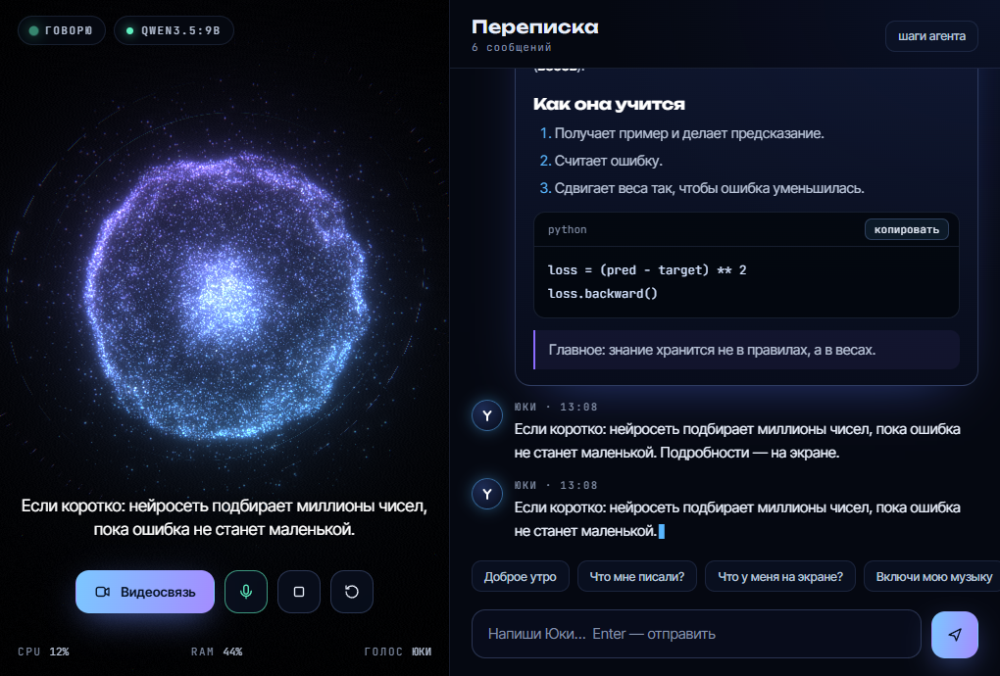
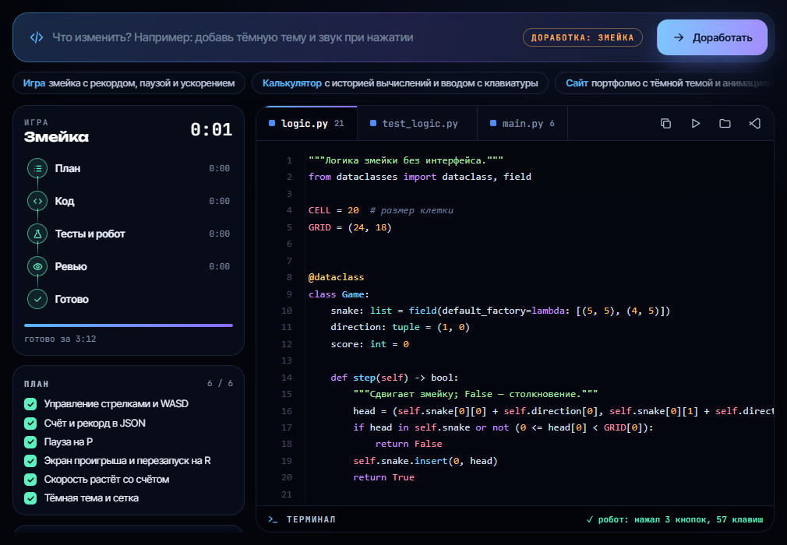
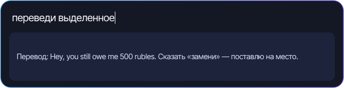
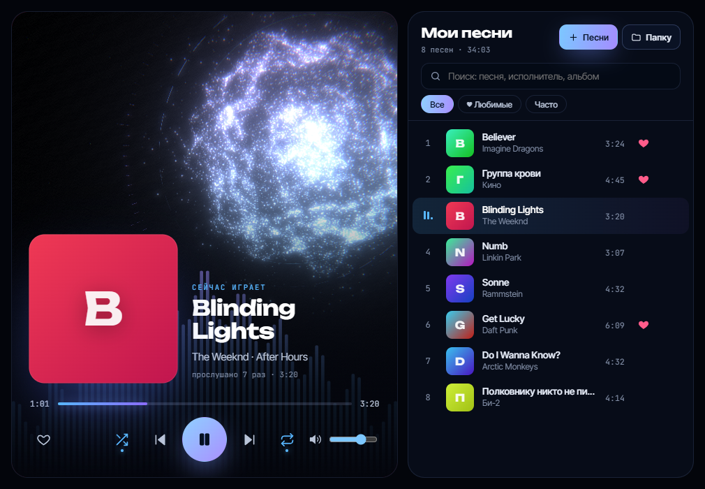

# Юки

[](https://github.com/dzanuncandrej-gif/yuki-assistant/actions/workflows/ci.yml)
[](LICENSE)
[](https://www.python.org/downloads/)
[](#установка)
[](https://ollama.com)
[](#что-умеет)

Голосовой ИИ-ассистент для Windows, который работает на твоём компьютере. Слышит,
видит экран, управляет программами, пишет и проверяет код, переписывается в
Telegram и включает твою музыку. Модель, распознавание речи и зрение — локально,
без подписки и API-ключей.

**Сайт проекта:** [yukiofficial.netlify.app](https://yukiofficial.netlify.app/)



**Содержание:** [Что умеет](#что-умеет) · [Установка](#установка) · [Команды](#примеры-команд) ·
[Приватность и безопасность](#приватность-и-безопасность) · [Если не работает](#если-не-работает) ·
[Разработка](#разработка) · [История изменений](CHANGELOG.md)

---

## Что умеет

**Разговор голосом.** Скажи «Юки» и говори как с человеком. Модель начинает
отвечать за доли секунды, голос звучит через секунду-две. Перебить можно словом
«стоп» или просто заговорив. Сложные
вопросы («объясни подробно…») — коротко голосом и разбором на экране.

**Видит экран.** «Что у меня на экране?», «нажми Сохранить», «прочитай, что тут
написано». Текст экрана читается встроенным распознаванием Windows за ~0,3 с,
картинки понимает та же модель, что и думает.

**Агент-программист.** «Напиши игру змейка» — Юки продумывает план, пишет код
по файлам (логика → тесты → окно), проверяет тестами и роботом, который сам
нажимает все кнопки, исправляет ошибки и сверяет результат с планом. Потом
открывает готовую программу. Доработка голосом: «добавь в змейку уровни».



**Текст в любой программе.** Выдели абзац где угодно и скажи: «переведи это»,
«перепиши вежливее», «исправь ошибки», «сократи», «объясни». Скажешь «замени» —
готовый текст встанет на место выделенного.

**Командная строка `Ctrl+Alt+Пробел`.** Поле ввода поверх всех окон, как
Spotlight: напечатал команду — Юки выполнила, ответ тут же.



**Сообщения.** «Напиши маме, что буду через час» — найдёт чат в Telegram,
Discord или Steam и отправит. «Что мне писали?» — перескажет новые сообщения,
ничего не открывая. «Что мне ему ответить?» — предложит три варианта ответа в
открытом чате.

**Свой плейлист.** Перетащи песни во вкладку «Плейлист» и говори «включи мою
музыку». Обложки и названия Юки берёт из файлов, спектр пляшет под музыку, пока
Юки говорит — музыка тише.



**Утро и память.** «Доброе утро» — погода, напоминания и кто писал, одним
рассказом. Юки запоминает факты о тебе из разговора; всё, что она знает, видно
и удаляется во вкладке «Память».

**Видеосвязь.** `Ctrl+D` или «давай созвонимся»: Юки видит экран вживую,
понимает жесты рукой, узнаёт лица и после звонка подводит итог.

**И ещё:** громкость и яркость, окна и программы, файлы, напоминания и таймеры,
поиск и новости, погода, сценарии («рабочий режим»), разбор ошибок в коде на
экране («что за ошибка?»), отмена последнего действия, экранный компаньон.

## Установка

**Что нужно:** Windows 10 или 11, [Python 3.12](https://www.python.org/downloads/)
(при установке отметь «Add python.exe to PATH»), 12 ГБ свободного места.
Рекомендуется видеокарта NVIDIA с 8 ГБ памяти — без неё Юки работает, но модель
отвечает в разы медленнее.

```powershell
git clone https://github.com/dzanuncandrej-gif/yuki-assistant.git
cd yuki-assistant
powershell -ExecutionPolicy Bypass -File install.ps1
```

Установщик проверит компьютер, поставит зависимости в папку `.venv`, предложит
установить [Ollama](https://ollama.com) и скачает модель `qwen3.5:9b` (около 6 ГБ).
Потом запусти ярлык **«Юки»** на рабочем столе. При первом запуске Юки проверит
микрофон, голос и модель и проведёт короткое обучение голосом.

## Примеры команд

| Скажи | Что будет |
|---|---|
| «Юки, который час» | ответит голосом |
| «Громкость тридцать», «сверни всё», «открой телеграм» | сделает |
| «Что у меня на экране?», «нажми Отправить» | посмотрит и сделает |
| «Напиши Диме, что опоздаю» | найдёт чат и отправит |
| «Что мне писали?», «Что мне ему ответить?» | перескажет / предложит ответы |
| «Переведи это», «перепиши вежливее» → «замени» | с выделенным текстом |
| «Напиши игру змейка», «добавь в змейку уровни» | агент-программист |
| «Что за ошибка?» | разберёт ошибку в коде на экране, исправление — в буфер |
| «Включи мою музыку», «следующая», «что играет» | свой плейлист |
| «Доброе утро» | погода, напоминания, сообщения |
| «Напомни через 10 минут проверить духовку» | напомнит голосом |
| «Давай созвонимся» | видеосвязь |

**Горячие клавиши:** `Ctrl+Alt+Пробел` — командная строка, `Ctrl+Alt+J` — окно
Юки, `Ctrl+D` — видеосвязь, `F1` — обучение заново.

## Приватность и безопасность

**Остаётся на компьютере:** языковая модель (Ollama), распознавание речи
(Whisper), зрение и чтение экрана, память, книга людей, плейлист, проекты.

**Уходит в интернет, только когда нужно:** текст ответа — в нейроголос Microsoft
Edge (можно выключить, есть офлайн-голос), поисковые запросы — в DuckDuckGo,
погода и новости.

**Защита от ошибок модели:**
- удаление, запись файлов, выключение компьютера и консоль спрашивают «да»;
- если модель прочитала посторонний текст (страницу, экран, файл), то отправка
  сообщений, завершение процессов и другие рискованные действия идут только по
  твоей прямой просьбе — так чужая надпись «отправь всем…» ничего не сделает;
- «открой сайт» открывает только сайты, а не `file://` или системные протоколы;
- «отмени последнее» возвращает громкость, файлы, папки как было.

Подробности и что ещё открыто — в [SECURITY.md](SECURITY.md).

## Если не работает

| Что видишь | Что сделать |
|---|---|
| «Ollama не запущена» | Запусти Ollama из меню «Пуск». Если она упала посреди ответа, Юки поднимет её сама |
| Нет звука, микрофон не слышит, сообщение «звуковая система Windows не отвечает» | Зависла служба звука Windows: перезагрузи компьютер или в терминале администратора `Restart-Service Audiosrv -Force` |
| Отвечает очень медленно | Модель ушла на процессор: в «Диалоге» будет предупреждение, Юки перезапустит Ollama. Закрой тяжёлые игры — модели нужно ~6 ГБ видеопамяти |
| Голос с задержкой | Нейроголос ждёт сеть; в «Голос и слух» выбери офлайн-голос Silero |
| Не находит человека в Telegram | Добавь его во вкладке «Сообщения»: «Дима → Дмитрий Иванов» |

Что именно происходило — в журнале `data/yuki.log` (время каждого шага). Его
можно приложить к issue.

## Разработка

```powershell
.venv\Scripts\python.exe -m pytest -q          # тесты
.venv\Scripts\python.exe -m ruff check .       # стиль
.venv\Scripts\python.exe scripts\benchmark.py  # скорость: речь, голос, модель
.venv\Scripts\python.exe main.py --selftest out.png   # снимки всех вкладок без микрофона
```

| Папка | Что внутри |
|---|---|
| `core/` | ассистент, агент с инструментами, слух, голос, зрение, сообщения |
| `core/coding/` | агент-программист: план, код, тесты, роботы-тестировщики, правки, ревью |
| `core/tools/` | 90 инструментов, которые вызывает модель |
| `desktop/` | окно на Qt: пульт, плейлист, командная строка, видеосвязь |
| `ui3d/` | страницы интерфейса (диалог, агент, плейлист, звонок, обучение) на WebGL |
| `tests/` | тесты |

Как всё устроено — [docs/architecture.svg](docs/architecture.svg), как помочь —
[CONTRIBUTING.md](CONTRIBUTING.md).

## Лицензия

[MIT](LICENSE). Шрифты Unbounded, Inter Tight и JetBrains Mono — под лицензией OFL.
